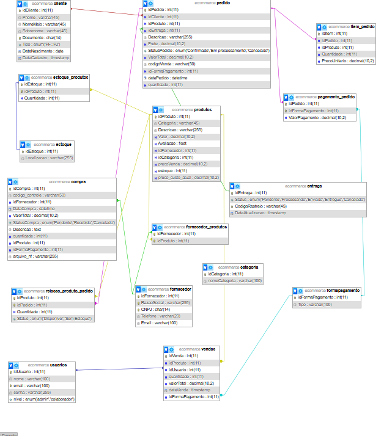

🛒 AWT Sales Manager

🚀 ERP Inteligente para Gestão Comercial e EstoqueTransformando processos comerciais em inteligência de negócio.

🔗 Demonstração Visual & Acesso

👉 Ver Projeto Online (Live Demo)

http://awaldige.infinityfree.me/ecommerce/

💻 Ambiente de Testes: Utilize o modo demonstração no login para explorar as métricas.

💡 Sobre o ProjetoO AWT Sales Manager é um sistema ERP Full-Stack desenvolvido para automatizar e otimizar operações comerciais de pequeno e médio porte.

✔ Substitui controles manuais (planilhas e papel).

✔ Centraliza dados estratégicos em uma única interface.

✔ Facilita decisões com base em métricas reais de lucro e investimento.

🗄️ Modelagem de Dados (Engenharia de Software)O sistema foi construído sobre uma base relacional sólida para garantir a integridade das informações e a escalabilidade do negócio.Diagrama de Entidade-Relacionamento (ERD)Abaixo, a representação visual de como as tabelas (Produtos, Vendas, Fornecedores e Clientes) se conectam:

Instalação do Banco: O script completo para recriar esta estrutura está disponível em /database/database.sql.

🚀 Funcionalidades Principais

📊 Dashboard em Tempo Real: Indicadores de faturamento, custo de mercadoria e lucro líquido.

📦 Controle de Inventário: Gestão de estoque com alertas de reposição e categorias dinâmicas.

🔐 Segurança: Autenticação robusta, criptografia de senhas e proteção contra SQL Injection.

📱 Mobile First: Interface 100% responsiva desenvolvida com Tailwind CSS para acesso via smartphone.

🧠 Arquitetura e StackCamadaTecnologiaFrontendHTML5, Tailwind CSS, JavaScript (ES6)BackendPHP 8.x (Estrutura Modular)Banco de DadosMySQL (Relacional/InnoDB)InfraestruturaApache / Linux / InfinityFree

🛠️ Como Rodar LocalmenteClone o repositório:Bashgit clone https://github.com/awaldige/awt-sales-manager.git
Configuração do Banco:Crie um banco de dados no seu MySQL (XAMPP/WAMP).Importe o arquivo /database/database.sql.Configuração do PHP:Ajuste as credenciais no arquivo config.php.Acesso:Mova a pasta para o htdocs e acesse localhost/awt-sales-manager.

👨‍💻 DesenvolvedorAndré Waldige

💻 Web Developer Freelancer

🤖 Especialista em IA & Transformação Digital"Tecnologia não é só código — é resultado."

⭐ Apoie o ProjetoSe este sistema foi útil para você ou serviu de inspiração:

⭐ Dê uma estrela no repositório.

💼 Conecte-se comigo para projetos personalizados.
